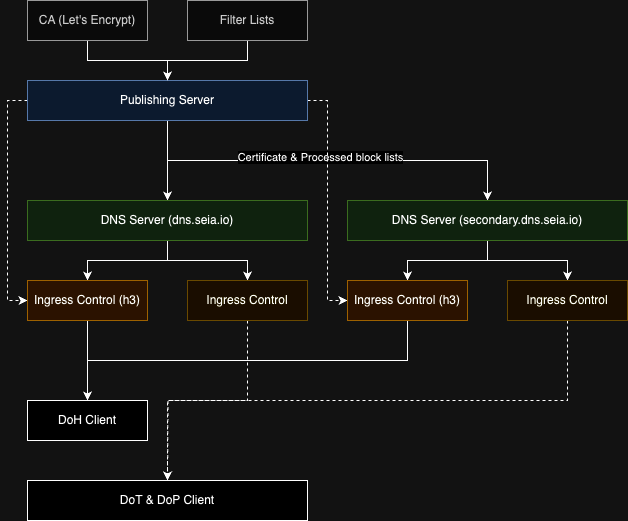

# [Xstl encrypted DNS](/)

[한국어](./202310-arch-update.ko.md)

---

# 2023년 10월, Arch update

This is DNS operation team.
There were several improvements and architecture rebuilding to improve the stability of the secondary DNS of Xstl encrypted DNS.

1. DoP (Plain DNS) support
2. DoH (DNS over HTTPS) support
3. Secondary DNS stability improvement

Please, apply new profiles in the main page or set privacy DNS in system to `https://dns.seia.io/dns-query` to use new protocols.

Thank you.
